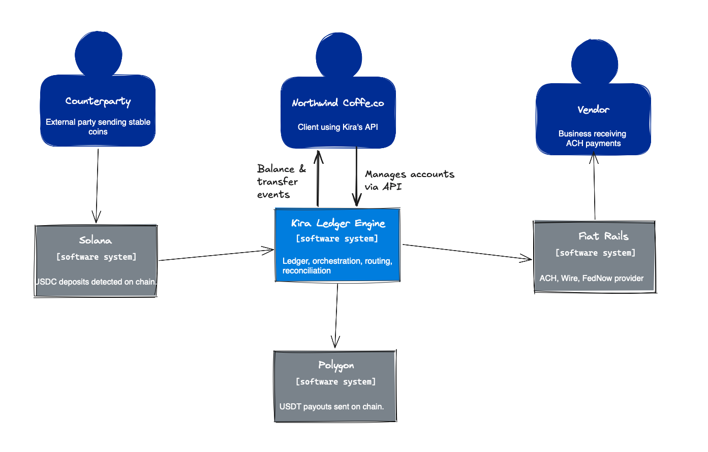
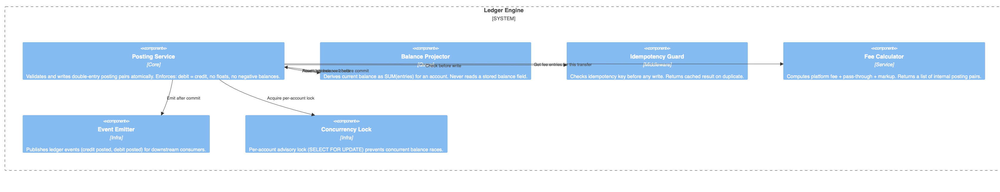
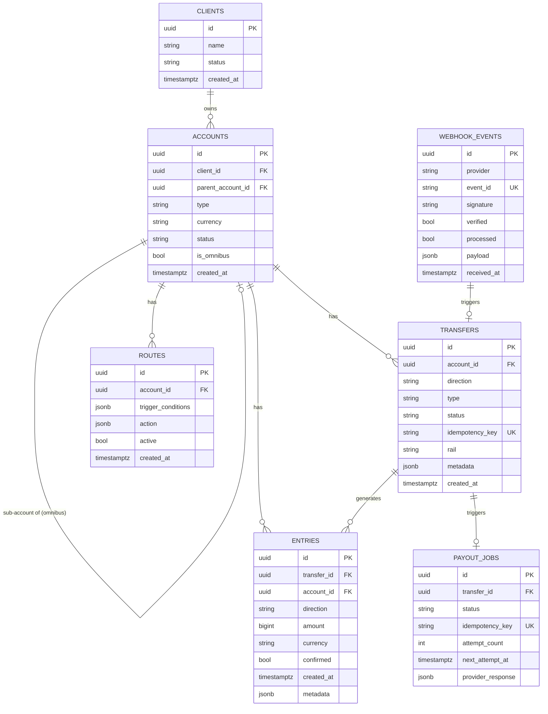

# DESIGN.md — Kira Fintech Ledger & Orchestration Engine

> **Status:** Draft — Day 1/2 (Plan & Understanding)
> **Author:** juan.chitiva
> **Last updated:** 2026-06-14

---

## Table of Contents

1. [Business Problem](#1-business-problem)
2. [Domain Model](#2-domain-model)
3. [The Northwind Flow](#3-the-northwind-flow)
4. [System Architecture — C4 Diagrams](#4-system-architecture--c4-diagrams)
   - [L1 — System Context](#l1--system-context)
   - [L2 — Container Diagram](#l2--container-diagram)
   - [L3 — Component Diagram (Ledger Engine)](#l3--component-diagram-ledger-engine)
5. [Ledger Model](#5-ledger-model)
6. [Concurrency & Consistency Hazards](#6-concurrency--consistency-hazards)
7. [Data Model Sketch](#7-data-model-sketch)
8. [Open Questions](#8-open-questions)

---

## 1. Business Problem

Kira Fintech moves money across rails that are fundamentally different:

| Rail | Settlement | Unit | Failure mode |
|---|---|---|---|
| ACH | T+1–T+2 | USD (cents) | Reversals up to 60 days |
| Wire / SWIFT | Same-day / T+1 | USD (cents) | Final, but fees vary |
| FedNow | Near-instant | USD (cents) | Final |
| Solana (USDC) | ~400ms / 32 conf | USDC (6 decimals) | Chain reorgs |
| Polygon (USDT) | ~2s / varies | USDT (6 decimals) | Chain reorgs |
| Tron (USDT) | ~3s | USDT (6 decimals) | Chain reorgs |

**The hard part:** keeping a single, correct set of books while money is simultaneously in-flight on all of these. A deposit that arrives on Solana isn't real money until it's confirmed. An ACH that's been sent can come back. A payout that was requested may or may not have hit the provider before a crash.

The ledger must be **the source of truth at every moment** — not the provider's dashboard.

---

## 2. Domain Model

### Account
A USD-denominated container belonging to a **Client** (Northwind Coffee Co.) or one of their **Sub-Clients**. It has a balance, but that balance is **never stored directly** — it is always derived by summing ledger entries. An account can receive inbound instructions (deposits expected) and holds routing rules.

### Omnibus Account
A Client's **top-level aggregation account**. Funds from all Sub-Clients are pooled here at the bank level, but the ledger keeps each Sub-Client's balance distinct via entries tagged to their own account IDs. The hierarchy is:

```
Client (e.g. Northwind Coffee Co.)
└── Omnibus Account          ← bank-level pool
    ├── Sub-Client Account A ← tracked separately on the ledger
    ├── Sub-Client Account B
    └── Sub-Client Account C
```

This means the sum of all Sub-Client available balances must always equal the Omnibus Account's available balance — a reconciliation invariant enforced at EOD.

### Transfer
Any movement of value touching an account. Three directions:

- `inbound` — money arriving 
- `outbound` — money leaving 
- `internal` — money moving between two accounts inside Kira

Two types: `fiat` (USD) and `crypto` (stablecoin).

### Ramp
The bridge between crypto and fiat:

- **Off-ramp:** stablecoin arrives on-chain → fees applied → USD credited to account
- **On-ramp:** USD debited from account → fees applied → stablecoin sent on-chain

A ramp is not just a conversion rate — it is an **atomic ledger operation** that must either complete fully or not at all.

### Route
A standing rule attached to an account: *"when condition X is met, automatically execute transfer Y."* Routes are evaluated after every inbound credit. They enable the auto-payout behavior in the Northwind flow.

### Fee
Every fee is a **ledger entry**, not a column. Platform fee (% of volume) + fixed pass-through + optional client markup are all posted as separate `internal` transfers between the client account and Kira's fee account. Fees are itemized so reconciliation is always exact.

---

## 3. The Northwind Flow

The canonical end-to-end sequence this system must support:

```
Counterparty
    │
    │  sends 5,000 USDC on Solana
    ▼
[Blockchain Watcher]
    │  detects tx, waits for confirmations
    ▼
[Off-Ramp Engine]
    │  converts USDC → USD
    │  posts fee entries (platform + pass-through)
    │  credits ~$4,995 USD to Northwind account  ← ledger write
    ▼
[Route Engine]
    │  evaluates standing rules for Northwind
    ├──▶ Route 1: ACH $4,200 → Vendor account
    │       posts debit + ACH provider call (idempotent)
    └──▶ Route 2: 600 USDT on Polygon → destination wallet
             posts debit + on-ramp + blockchain send (idempotent)
    ▼
[EOD Reconciliation]
    │  derives all balances from entries
    │  cross-checks with provider statements
    └──▶ reconciliation report
```

**Key invariants at each step:**
- The blockchain deposit is not credited until `N` confirmations (reorg-safe threshold)
- Fee entries are posted atomically with the credit — you can't credit without also posting fees
- Each route execution carries an idempotency key — retrying a route never moves money twice
- The ACH and crypto sends happen **after** the ledger debit — if the provider call fails, the debit is still there and a background job retries using the same idempotency key

---

## 4. System Architecture — C4 Diagrams

### L1 — System Context



---

### L2 — Container Diagram


---

### L3 — Component Diagram (Ledger Engine)



---

## 5. Ledger Model

### Core principle: double-entry, append-only

Every movement of value creates **two entries** — a debit from one account and a credit to another. The entries table is **never updated or deleted**. Balance is always `SUM(amount) WHERE account_id = X`.

### Entry anatomy

```
entry
├── id              UUID, primary key
├── transfer_id     FK → transfers (groups the double-entry pair)
├── account_id      FK → accounts
├── direction       ENUM('debit', 'credit')
├── amount          BIGINT (integer minor units — cents for USD, 6-decimal units for crypto)
├── currency        ENUM('USD', 'USDC', 'USDT', ...)
├── created_at      TIMESTAMPTZ (immutable)
└── metadata        JSONB (rail-specific details, chain tx hash, etc.)
```

### Fees as entries

When a 5,000 USDC off-ramp occurs (assume $5,000 USD equivalent, 0.1% platform fee + $0.25 pass-through):

| transfer_id | account | direction | amount | currency | note |
|---|---|---|---|---|---|
| T1 | Northwind | credit | 499,975 | USD (cents) | net credit after fees |
| T1 | Kira Platform Fee | debit | 500 | USD (cents) | 0.1% platform fee |
| T1 | Kira Pass-through | debit | 25 | USD (cents) | fixed pass-through |
| T1 | Liquidity Pool | credit | 500,000 | USD (cents) | source (off-ramp) |

> All rows in the same transaction. Atomic or nothing.

### Balance derivation

```sql
SELECT
  SUM(CASE WHEN direction = 'credit' THEN amount ELSE -amount END) AS balance
FROM entries
WHERE account_id = $1
  AND currency = 'USD';
```

No `balance` column anywhere. Snapshot/materialized balance can be cached for performance but the query above is always authoritative.

### Pending vs. Available balance

The glossary mandates keeping these distinct — **payouts may only draw on available balance**.

The distinction lives in the `ENTRIES` table via a `confirmed` boolean on each entry:

```sql
-- Available balance (confirmed entries only — safe to spend)
SELECT
  SUM(CASE WHEN direction = 'credit' THEN amount ELSE -amount END) AS available_balance
FROM entries
WHERE account_id = $1
  AND currency = 'USD'
  AND confirmed = true;

-- Pending balance (all entries including unconfirmed deposits)
SELECT
  SUM(CASE WHEN direction = 'credit' THEN amount ELSE -amount END) AS pending_balance
FROM entries
WHERE account_id = $1
  AND currency = 'USD';
```

An inbound crypto deposit is written immediately as `confirmed = false` (visible, pending). The Blockchain Watcher upgrades it to `confirmed = true` once the confirmation threshold is met. Fiat inbound entries are written as `confirmed = true` immediately (the rail guarantees are handled by the provider).

---

## 6. Concurrency & Consistency Hazards

### Hazard 1 — Concurrent outbound payouts (negative balance race)

**Scenario:** Two route firings both read a balance of $4,995, both see it's sufficient, both proceed to debit $4,200. Result: balance goes to -$3,405.

**Guardrail:** Row-level lock on the account row (`SELECT FOR UPDATE`) held for the duration of the balance check + entry write within a single DB transaction. No optimistic retry — the lock is cheap and the window is small.

### Hazard 2 — Duplicate webhook / retry (double credit)

**Scenario:** The blockchain watcher fires a credit event; the server crashes after the ledger write but before ACKing. The watcher retries and fires again.

**Guardrail:** Every inbound transfer is keyed on `(chain, tx_hash, log_index)`. The idempotency guard checks this key before any write and returns the original result on a duplicate — no second ledger entry is ever created.

### Hazard 3 — Crash between ledger debit and provider call

**Scenario:** Route fires, ledger debit is posted, server crashes before the ACH call reaches the provider. On restart, the debit exists but no payout happened. Or the call was made but the response was lost — we don't know if money moved.

**Guardrail:** Outbox pattern. The payout job is written to the DB in the same transaction as the ledger debit. A background worker reads the outbox and makes the provider call, marking the job complete only after a confirmed provider response. Idempotency key on the provider call prevents double-send on retry.

### Hazard 4 — Unconfirmed deposit credited too early (chain reorg)

**Scenario:** A Solana transaction is detected with 1 confirmation; we credit the account; the block is reorganized and the transaction disappears.

**Guardrail:** Blockchain watcher only triggers a credit after `N` confirmations (configurable per chain — e.g. 32 for Solana). Deposit stays in a `pending` state until threshold is met. The entry is written immediately as `confirmed = false`; the watcher flips it to `confirmed = true` — no money is ever duplicated, only the confirmation flag changes.

### Hazard 5 — Malicious or replayed webhooks

**Scenario:** A provider sends an inbound webhook claiming a deposit arrived. An attacker replays the same webhook, or sends a forged one. Either way, the system credits an account it shouldn't.

**Guardrail:** Three layers:
1. **Signature verification** — every inbound webhook must carry a provider signature (HMAC or similar); requests that fail verification are rejected before any processing.
2. **Replay protection** — webhook events carry a unique event ID; the idempotency guard rejects any event ID already seen.
3. **Out-of-order delivery** — events are processed in the order of their `sequence` or `block_height`, not arrival time. A late-arriving event for a transfer already finalized is a no-op.

### Reconciliation mismatch types

Two failure modes the EOD reconciler must detect:

| Type | Description | Action |
|---|---|---|
| **Settled-with-no-entry** | The rail/chain moved money but the ledger has no record | Alert + manual review; likely a missed webhook or watcher gap |
| **Entry-never-confirmed** | The ledger recorded a movement that never actually settled | Alert + reversal entry if settlement window has expired |

---

## 7. Data Model Sketch

> First-pass ERD — to be refined during implementation.



---

## 8. Open Questions

> Tracked here; answered in `DECISIONS.md` as calls are made.

- [ ] What confirmation threshold per chain? (Solana: 32? Polygon: 128?)
- [ ] How do we handle partial fills on ACH (provider sends less than requested)?
- [ ] Should routes support conditions beyond simple "on-inbound-credit"? (e.g. scheduled, threshold-based)
- [ ] On-ramp rate source — hardcoded mock rate for now or integrate a price feed?
- [ ] Reconciliation mismatch resolution — auto-flag only, or auto-correct?
- [ ] Multi-currency account support in scope for Days 3–4, or USD-only?